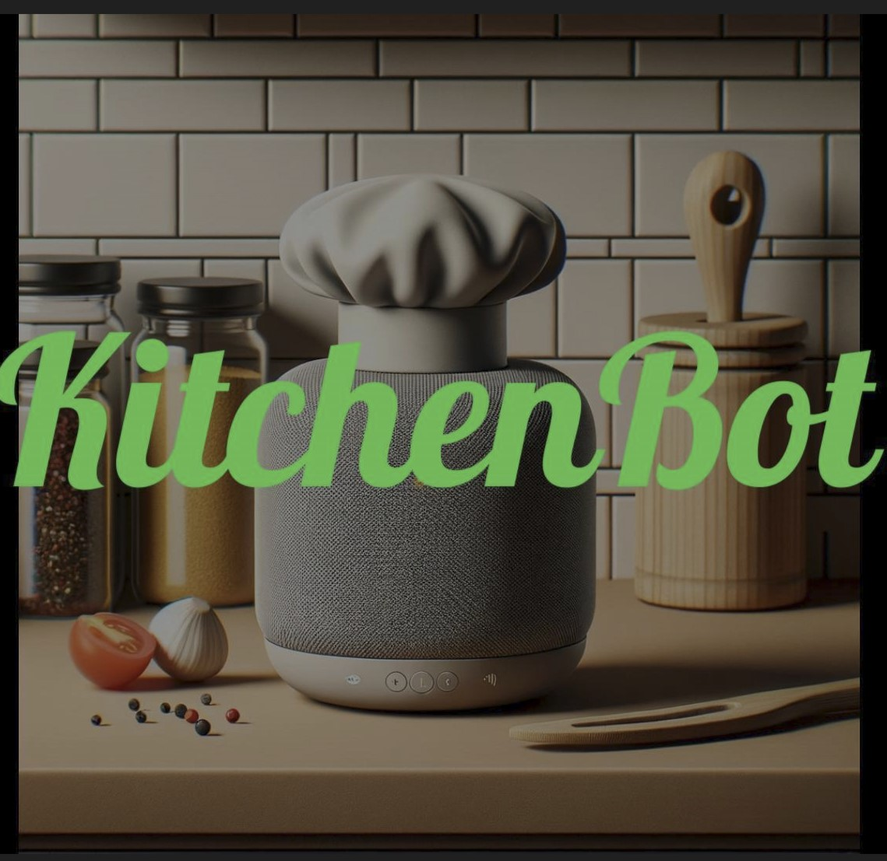

## KitchenBot

This was a group project I worked on during my Human-Computer Interaction class. KitchenBot is not a real product, it's a prototype we designed and visualized. It's meant to help you cook and shop - see the demo video, directed and produced by yours truly, [here](https://drive.google.com/file/d/1iO96fj9OvmsLLxLFKuAtZGFSMgm_iL2d/view?usp=sharing)!

