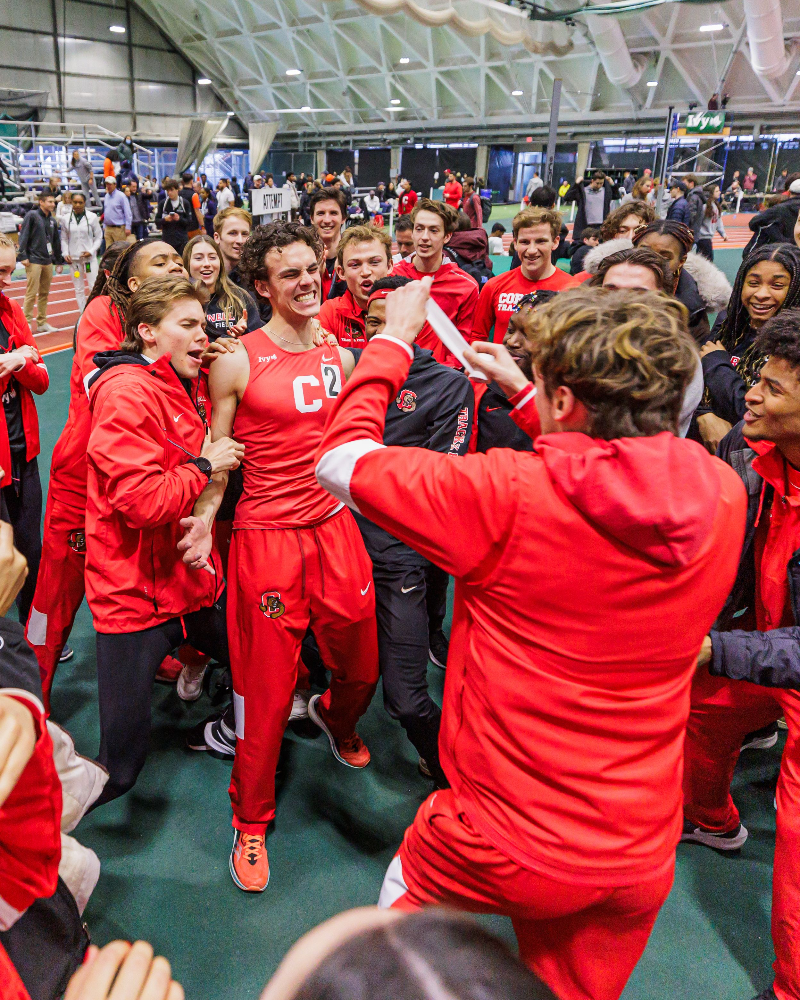

# Welcome to Pelham's website!

I'm an Electrical and Computer Engineering student currently studying at Cornell University. This website is meant to show off my projects, most of which have to do  with microcontrollers, digital signal processing, music, or all of the above. 

I'm still working on this website, so please pardon the appearance of any incomplete pages.

* * *

# Projects

- [Maze Solving Robot](LAB4.MD)
    
<video width="500" height="700" src="IMG_6084.mp4" type="video/mp4" preload="auto" autoplay muted loop>
</video>

* * *

# Coursework

I've taken classes covering a wide range of subjects.

* * * 

# Personality

## Music

I enjoy playing piano and producing music in Ableton. 

I started messing around with the piano while taking a GarageBand class in 8th grade. I decided that I would learn  how to play, so I got lessons at the nearby "School of Rock" . . . until my parents made me quit these lessons to study for the SAT/ACT. 

Anyways, I kept playing piano, and since my lessons ended, I've forgotten almost everything about how to read music, instead opting to create original chord progressions and songs while expanding my knowledge of music theory. Some of my productions are linked below. You can also find my entire SoundCloud library [here](https://soundcloud.com/pelhamb) if you're interested.

[This](https://on.soundcloud.com/Kyiva) one samples "Up On The Roof" by the Drifters, the rest is played by yours truly. You have to listen all the way.

<iframe width="80%" height="200" scrolling="no" frameborder="no" allow="autoplay" src="https://w.soundcloud.com/player/?url=https%3A//api.soundcloud.com/tracks/1656904323&color=%23ff5500&auto_play=false&hide_related=false&show_comments=true&show_user=true&show_reposts=false&show_teaser=true&visual=true"></iframe>
<a href="https://soundcloud.com/pelhamb" title="Pelham" target="_blank" style="color: #cccccc; text-decoration: none;">Pelham</a> · <a href="https://soundcloud.com/pelhamb/on-the-roof-v1" title="on the roof v1" target="_blank" style="color: #cccccc; text-decoration: none;">on the roof v1</a>

[Here](https://on.soundcloud.com/e7UPp)'s another one. This samples "Dawn in the Adan" by Ichiko Aoba (one of my favorite songs from of my favorite artists), as well as "St. Thomas" by Bibio.

<iframe width="80%" height="200" scrolling="no" frameborder="no" allow="autoplay" src="https://w.soundcloud.com/player/?url=https%3A//api.soundcloud.com/tracks/1450834441&color=%23ff5500&auto_play=false&hide_related=false&show_comments=true&show_user=true&show_reposts=false&show_teaser=true&visual=true"></iframe>
<a href="https://soundcloud.com/pelhamb" title="Pelham" target="_blank" style="color: #cccccc; text-decoration: none;">Pelham</a> · <a href="https://soundcloud.com/pelhamb/st-ichiko-v3" title="st ichiko v4" target="_blank" style="color: #cccccc; text-decoration: none;">st ichiko v4</a>

* * * 

## Running

 My senior year of college, I was elected a team captain of the Cornell Men's Varsity Track & Field team.

 

 * * * 